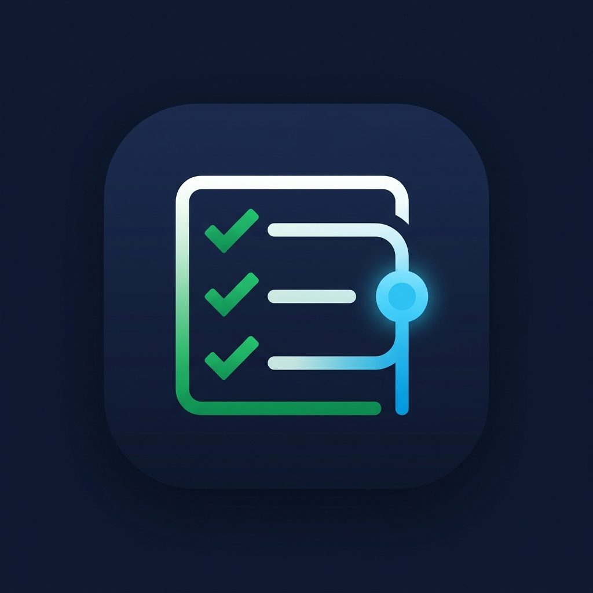

# Commity

> 🤖 `TASKS.md` üzerindeki git diff analizini yaparak tamamlanan görevlerden otomatik olarak Conventional Commit (Kurallı Commit) mesajları üreten VS Code ve Antigravity IDE uyumlu yapay zeka destekli eklenti.

🇬🇧 **For English documentation, please see [README.md](file:///home/egemen/data/yazilim/node/commity/README.md).**



## Özellikler

- ✅ **Tamamlanan Görevleri Algılama** — `TASKS.md` üzerindeki `git diff HEAD` sonucunu analiz ederek sadece `[ ]` (yapılacak) durumundan `[x]` (tamamlandı) durumuna geçen satırları yakalar.
- 🤖 **Yapay Zeka Destekli Commit Mesajları** — Antigravity veya Copilot chat paneline (`workbench.action.chat.open`) otomatik prompt gönderir. Sohbet paneli yoksa `vscode.lm` (VS Code Dil Modeli API'si) veya OpenAI uyumlu HTTP endpoint fallback zincirini çalıştırır.
- 📋 **Onay ve Çalıştırma** — Eklenti kendi başına onay almadan commit atmaz. Önizleme ekranında `git add . && git commit -m "..."` komutlarını gösterir, tek tıkla entegre terminalde çalıştırmanıza olanak tanır.
- ✏️ **Düzenlenebilir Arayüz** -- AI'ın ürettiği commit mesajını terminalde çalıştırmadan önce webview üzerinde düzenleyebilirsiniz.
- 🔄 **Yeniden Üretme (Regenerate)** — Beğenmediğiniz commit mesajlarını tek butonla yeniden üretebilirsiniz.
- 🎨 **VS Code Temasıyla Uyumlu** — Arayüz tamamen VS Code renk paletine (koyu/açık tema) uyum sağlar.

## Çalışma Mantığı

```
Ctrl+Shift+P → "Commity: Generate Commit Message"
       │
       ▼
1. Git repo kökünü tespit eder
2. TASKS.md (veya tasks.md / Todo.md / TODO.md) dosyasını bulur
3. git diff HEAD -- TASKS.md komutunu çalıştırır
4. Sadece [ ] -> [x] geçişlerini ayıklar
5. Tamamlanan görevlerle bir AI prompt'u oluşturur
       │
       ├─ Antigravity / Copilot chat paneli varsa
       │     └─ Promptu chat paneline yazar → AI yanıtı orada üretilir
       │
       └─ Chat paneli yoksa
             ├─ vscode.lm API → doğrudan mesajı üretir
             ├─ OpenAI uyumlu API → doğrudan mesajı üretir
             └─ Mock (Geliştirici modu) → örnek mesaj döner
       │
       ▼
6. Onay paneli açılır:
   ┌──────────────────────────────────────────┐
   │  feat(engine): implement physics engine   │ ← Düzenlenebilir
   │                                           │
   │  git add .                                │
   │  git commit -m "feat(engine): implement..." │
   │                                           │
   │  [▶ Terminalde Çalıştır] [📋 Kopyala]      │
   └──────────────────────────────────────────┘
```

## Kurulum

### VSIX Dosyasından Manuel Kurulum
```bash
git clone https://github.com/kullanici_adin/commity.git
cd commity
npm install
npm run compile
npx vsce package
# Sonrasında VS Code/Antigravity üzerinde: Uzantılar (Extensions) → ··· → Install from VSIX
```

### Geliştirici Modunda Test Etme (F5)
```bash
git clone https://github.com/kullanici_adin/commity.git
cd commity
npm install
# Projeyi VS Code / Antigravity ile açın
# F5 tuşuna basın → Yeni test penceresi açılacaktır
```

## Gereksinimler

- VS Code `^1.85.0` veya Antigravity IDE
- Bir Git reposu ve içerisinde görev listesi içeren bir `TASKS.md` dosyası
- **Yapay zeka özellikleri için aşağıdakilerden biri:**
  - Antigravity IDE (Dahili yapay zeka sohbet paneli üzerinden)
  - GitHub Copilot Chat eklentisi
  - OpenAI API Key (veya uyumlu bir API endpoint)
  - Ollama / LM Studio (Yerel modeller için, API anahtarı gerekmez)

## Ayarlar

| Ayar | Varsayılan | Açıklama |
|---|---|---|
| `commity.preferredProvider` | `"auto"` | `auto` / `chat` / `vscode-lm` / `openai` / `mock` |
| `commity.openaiApiKey` | `""` | OpenAI veya uyumlu API anahtarı |
| `commity.openaiBaseUrl` | `"https://api.openai.com/v1"` | API endpoint adresi (Ollama, LM Studio vb. destekler) |
| `commity.model` | `"gpt-4o"` | Model adı |
| `commity.temperature` | `0.3` | Yaratıcılık oranı (0–2) |
| `commity.conventionalCommitStyle` | `true` | Kurallı commit formatını zorunlu kılar (`feat/fix/chore...`) |
| `commity.promptTemplate` | `""` | Özel prompt şablonu. `{tasks}` yer tutucusunu kullanın |
| `commity.preferredTasksFilename` | `""` | Otomatik dosya taramayı bypass edip sabit bir dosya seçer |
| `commity.autoCopy` | `false` | Üretilen komutları otomatik olarak panoya kopyalar |
| `commity.maxRetries` | `3` | AI geçersiz format ürettiğinde yapılacak maksimum deneme sayısı |

## TASKS.md Formatı

Commity standart markdown görev listelerini destekler:

```markdown
## Sprint 3

- [x] Fizik motorunu yaz            ← ✅ Algılanır (önceden seçilmemişti)
- [x] Çarpışma sistemini entegre et ← ✅ Algılanır
- [ ] Çoklu oyuncu desteği ekle     ← ⏭ Pas geçilir (tamamlanmamış)
- [x] Zaten önceden tamamlanmıştı   ← ⏭ Pas geçilir (HEAD commit'inde zaten [x] durumundaydı)
```

Sadece bu commit içerisinde `[ ]` durumundan `[x]` durumuna geçen satırlar dikkate alınır.

## Lisans

MIT © 2026 Muhammed Egemen Geyik
